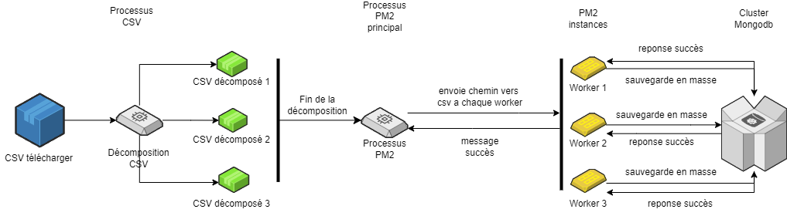
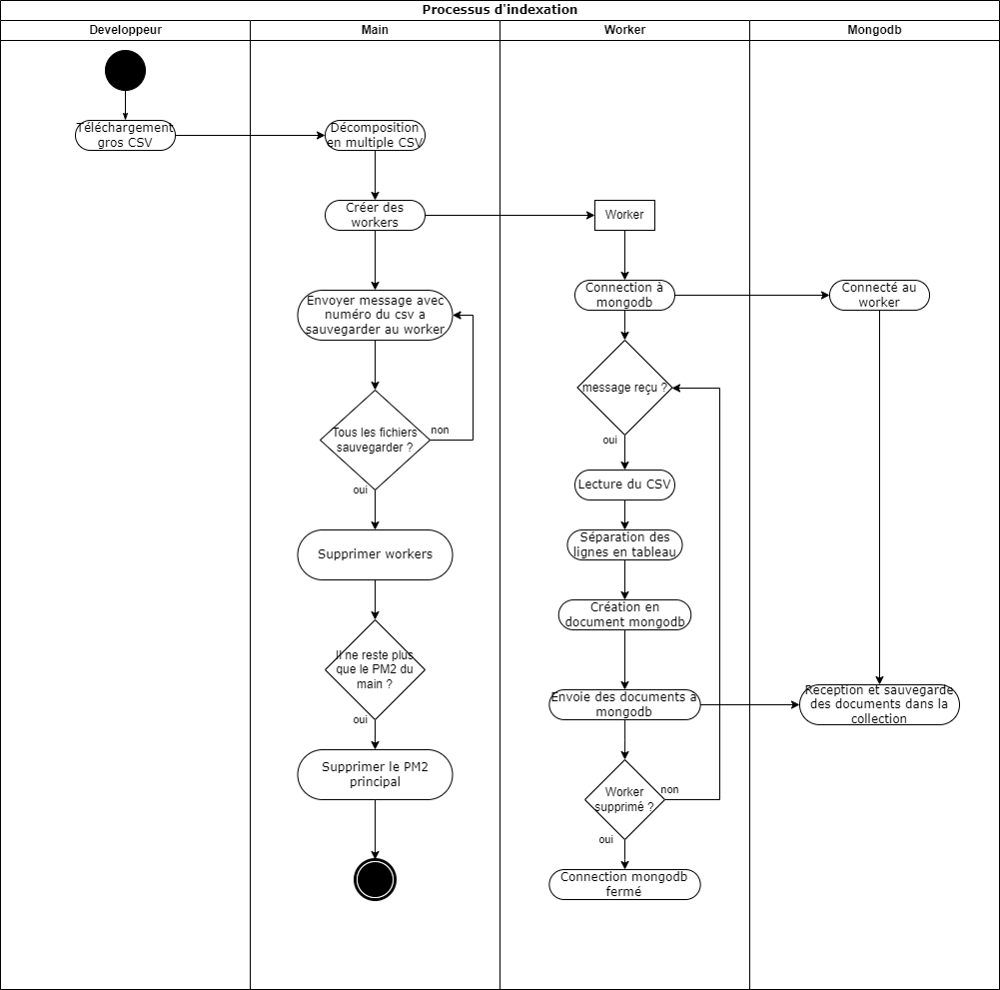

L'exercice sur les requêtes demandé lundi est présent dans le projet git, il s'agit du fichier **exo1.txt**
# Documentation du Processus d'Indexation

## Introduction

Cette documentation décrit le processus d'indexation des données du fichier CSV **Sirene : Fichier StockEtablissement**.
Ce fichier CSV volumineux sera décomposer fichiers plus petit, puis indexer dans une base de données MongoDB.

## Fichiers du Programme
- **main.js**: Ce fichier contient le script principal du programme. Il divise le fichier CSV en morceaux plus petits et gère le processus d'indexation dans la base de données MongoDB.
- **worker.js**: Ce fichier est utilisé comme script pour les workers. Chaque worker est responsable de l'indexation des données d'un fichier CSV dans la base de données MongoDB.
- **process.json**: Ce fichier est une configuration pour PM2, définissant les paramètres d'exécution du programme, tels que le redémarrage automatique, la gestion des journaux, etc.
## Pré-requis

Avant de commencer, il faut avoir :
- Avoir télécharger le fichier CSV “Sirene : Fichier StockEtablissement” à cette adresse : https://www.data.gouv.fr/fr/datasets/base-sirene-des-entreprises-et-de-leurs-etablissements-siren-siret/
- Node.js installé sur votre système.
- MongoDB opérationnel (local ou hébergé, par exemple MongoDB Atlas).
- Les dépendances nécessaires pour le script d'indexation (`mongoose`, `pm2`). en faisant exécutant la commande ci-dessous
```
npm i
```
- Remplacer les chemins d'emplacement de fichier marquer en dur dans le `main.js` dans les constantes **inputFilePath** et **outputFilePath**

## Étapes du processus

1. **Lecture et Division du Fichier CSV**:
  - Le fichier principal `main.js` commence par lire le fichier CSV spécifié.
  - Il divise ensuite le fichier en plusieurs fichiers plus petits en fonction d'une taille de morceau spécifiée, en préservant l'en-tête dans chaque fichier résultant.

2. **Démarrage des Workers**:
  - Une fois les fichiers CSV divisés, le programme se connecte à PM2 pour démarrer les workers.
  - Chaque worker est configuré pour exécuter le script `worker.js` qui est responsable de l'indexation des données dans MongoDB.

3. **Indexation des Données**:
  - Chaque worker reçoit un numéro de fichier à traiter.
  - Le worker lit le fichier CSV correspondant et extrait les données nécessaires.
  - Les données sont ensuite indexées dans la base de données MongoDB.
  - Une fois l'indexation terminée pour un fichier, le worker signale au processus principal la réussite de l'opération.

4. **Gestion des Workers**:
  - Après avoir traité tous les fichiers, le processus principal vérifie si tous les workers ont terminé leur tâche.
  - Si oui, les workers sont arrêtés avec succès.
  - Enfin, si le processus principal est le dernier processus PM

## Éxécution du programme
Pour démarrer le programme éxécuté la commande suivante : 
```
pm2 start process.json
```
Les journaux de sortie et les erreurs sont enregistrés dans les fichiers `logs/output.log` et `logs/error.log` respectivement.
Il est également possible de monitorer directement pendant l'éxécution du programme avec la commande suivante : 
```
pm2 monit
```

## Schéma du processus


## Diagramme d'activité
